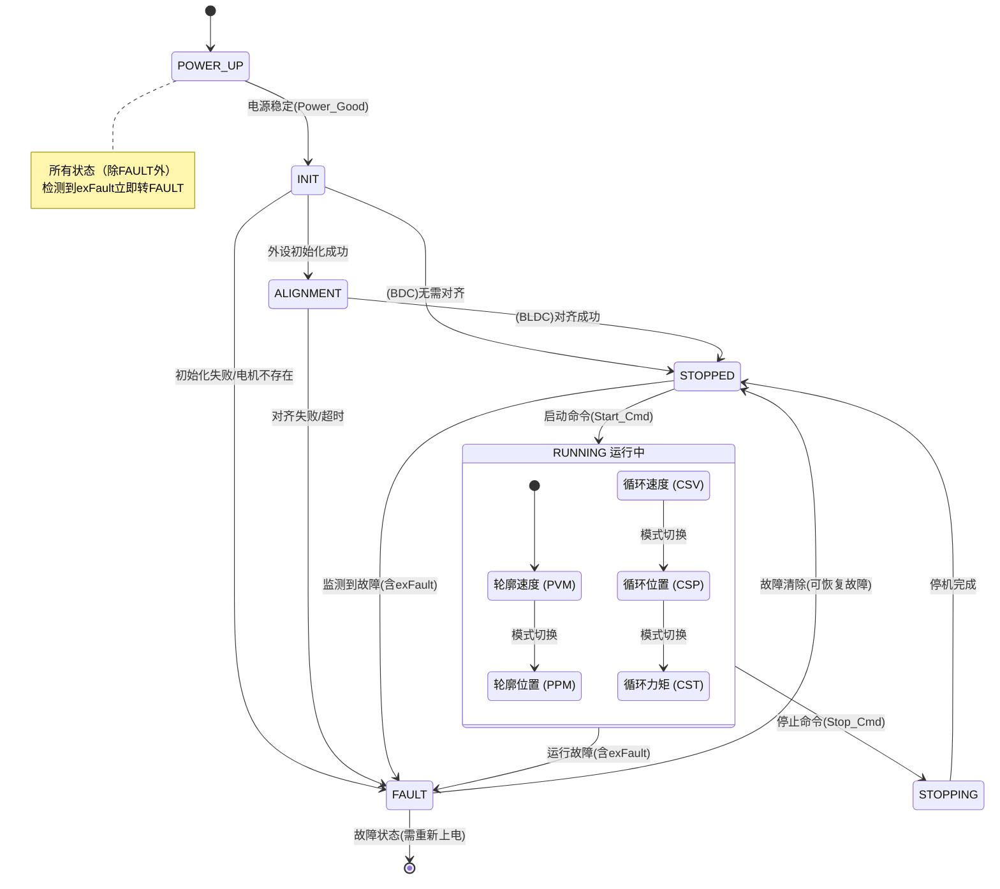

### 2.1 电机状态管理与运动控制

```mermaid

stateDiagram-v2
    [*] --> POWER_UP
    
    state "RUNNING 运行中" as RUNNING {     
            PVM : 轮廓速度 (PVM)
            PPM : 轮廓位置 (PPM)
            CSV : 循环速度 (CSV)
            CSP : 循环位置 (CSP)
            CST : 循环力矩 (CST)

            [*] --> PVM
            PVM --> PPM : 模式切换
            %% PPM --> CSV : 模式切换
            CSV --> CSP : 模式切换
            CSP --> CST : 模式切换
        }

    POWER_UP --> INIT : 电源稳定(Power_Good)

    INIT --> ALIGNMENT : 外设初始化成功
    INIT --> FAULT : 初始化失败/电机不存在
    INIT --> STOPPED : (BDC)无需对齐

    ALIGNMENT --> STOPPED : (BLDC)对齐成功
    ALIGNMENT --> FAULT : 对齐失败/超时

    STOPPED --> RUNNING : 启动命令(Start_Cmd)
    STOPPED --> FAULT : 监测到故障(含exFault)

    RUNNING --> STOPPING : 停止命令(Stop_Cmd)
    RUNNING --> FAULT : 运行故障(含exFault)

    STOPPING --> STOPPED : 停机完成

    %% 全局外部故障入口（除FAULT自身）
    note right of POWER_UP
        所有状态（除FAULT外）
        检测到exFault立即转FAULT
    end note

    %% FAULT状态处理
    FAULT --> STOPPED : 故障清除(可恢复故障)
    FAULT --> [*] : 故障状态(需重新上电)

    %% END
    
```
