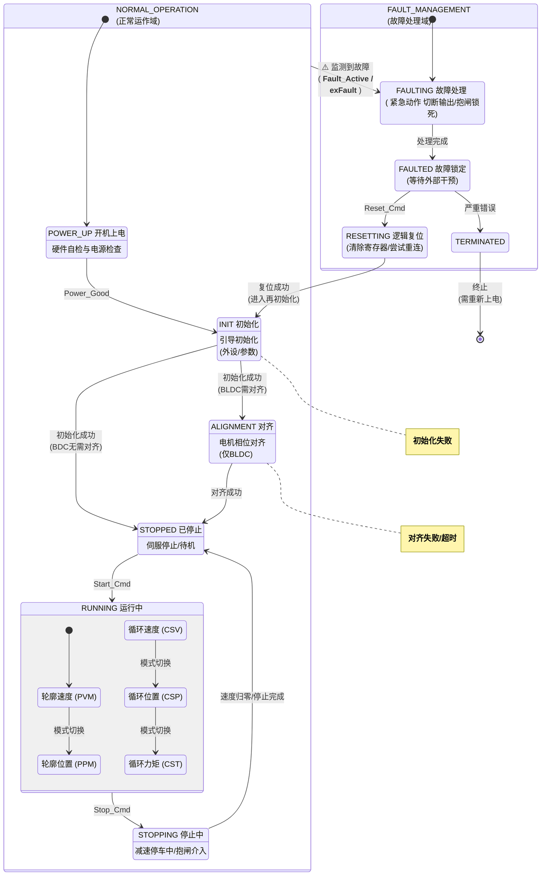

### 2.1 电机状态管理与运动控制

```mermaid

stateDiagram-v2
    direction TB

    %% 顶层隔离：正常域与故障域
    state "NORMAL_OPERATION <br>(正常运作域)" as NF {
        [*] --> POWER_UP
        
        state "POWER_UP 开机上电" as POWER_UP : 硬件自检与电源检查
        state "INIT 初始化" as INIT : 引导初始化 <br>(外设/参数)
        state "ALIGNMENT 对齐" as ALIGNMENT : 电机相位对齐 <br>(仅BLDC)
        state "STOPPED 已停止" as STOPPED : 伺服停止/待机
        state "STOPPING 停止中" as STOPPING : 减速停车中/抱闸介入

        %% 运行子状态机
        state "RUNNING 运行中" as RUNNING {     
            PVM : 轮廓速度 (PVM)
            PPM : 轮廓位置 (PPM)
            CSV : 循环速度 (CSV)
            CSP : 循环位置 (CSP)
            CST : 循环力矩 (CST)
            
            [*] --> PVM
            PVM --> PPM : 模式切换
            %% PPM --> CSV : 模式切换
            CSV --> CSP : 模式切换
            CSP --> CST : 模式切换
        }

        %% 正常流转逻辑
        POWER_UP --> INIT : Power_Good
        INIT --> ALIGNMENT : 初始化成功 <br>(BLDC需对齐)
        INIT --> STOPPED : 初始化成功 <br>(BDC无需对齐)
        ALIGNMENT --> STOPPED : 对齐成功
        STOPPED --> RUNNING : Start_Cmd
        RUNNING --> STOPPING : Stop_Cmd
        STOPPING --> STOPPED : 速度归零/停止完成
    }

    %% 故障处理域
    state "FAULT_MANAGEMENT <br>(故障处理域)" as FR {
	    
        [*] --> FAULTING
        FAULTING : FAULTING 故障处理 <br>( 紧急动作 切断输出/抱闸锁死)
        FAULTED : FAULTED 故障锁定 <br>(等待外部干预)
        RESETTING : RESETTING 逻辑复位 <br>(清除寄存器/尝试重连)

        FAULTING --> FAULTED : 处理完成
        FAULTED --> RESETTING : Reset_Cmd
        
        %% 根据故障严重程度的分支
        FAULTED --> TERMINATED : 严重错误
    }

    state TERMINATED : 终止
    TERMINATED --> [*] : 终止 <br>(需重新上电)

    %% 全局跳转逻辑
    %% 正常域中任何位置检测到故障(含exFault)均进入故障域
    %% 初始化/对齐失败直接触发故障
    NF --> FAULTING : ⚠️ 监测到故障 <br> ( <b> Fault_Active / <br>exFault </b> )
    %% NF --> FAULTING : ⚠️ 监测到故障 <br> ( <b> Fault_Active | exFault <br> 初始化失败 <br> 对齐失败/超时</b> )
    
    %% 初始化/对齐失败直接触发故障
    %% INIT --> FR : 初始化失败
    %% ALIGNMENT --> FR : 对齐失败/超时
    note right of INIT 
    	<span style="color:black">**初始化失败**</span>
    end note
    note right of ALIGNMENT
    	<span style="color:black">**对齐失败/超时**</span>
    end note
    %% 故障恢复路径
    RESETTING --> INIT : 复位成功 <br>(进入再初始化)
    
    %% END
```
