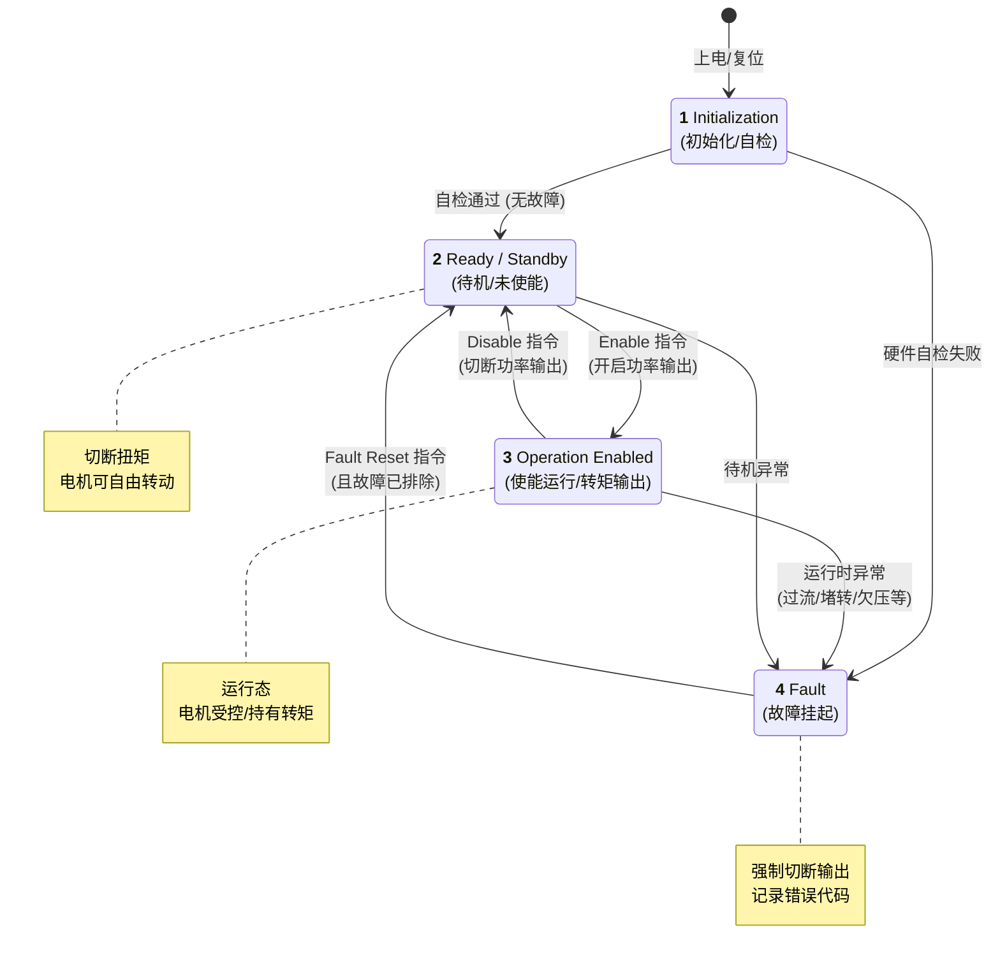

### 2.2 CiA402状态转换图（简化版）

```mermaid
stateDiagram-v2
    direction TB

    %% 状态定义
    state "**1** Initialization<br>(初始化/自检)" as S0
    state "**2** Ready / Standby<br>(待机/未使能)" as S1
    state "**3** Operation Enabled<br>(使能运行/转矩输出)" as S4
    state "**4** Fault<br>(故障挂起)" as S6

    %% 转换逻辑
    [*] --> S0 : 上电/复位
    
    S0 --> S1 : 自检通过 (无故障)
    S0 --> S6 : 硬件自检失败

    S1 --> S4 : Enable 指令 <br>(开启功率输出)
    S4 --> S1 : Disable 指令 <br>(切断功率输出)

    S4 --> S6 : 运行时异常 <br>(过流/堵转/欠压等)
    S1 --> S6 : 待机异常
    
    S6 --> S1 : Fault Reset 指令 <br>(且故障已排除)

    %% 细节备注
    note right of S1 : 切断扭矩<br>电机可自由转动
    
    note right of S4 : 运行态<br>电机受控/持有转矩
    
    note right of S6 : 强制切断输出<br>记录错误代码
    
    %% 握手交互说明
    %% note right of S1
    %% 	<span style="color:blue">**对齐失败/超时**</span>
    %% end note

```
